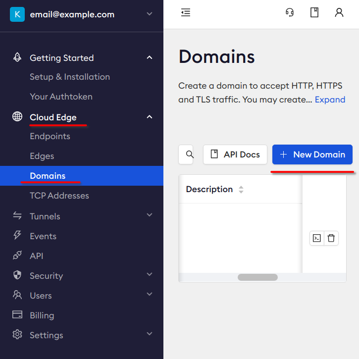

# Telegram Pictionary It

It is a telegram mini Web App game in which players draw and guess pictures.
It is made for the Telegram Contest.

## Demo

Send any message to [@pictionaryitbot](https://t.me/pictionaryitbot) and following the instructions.

## Requirnments

- [docker](https://www.docker.com/products/docker-desktop/).
- [make](https://en.wikipedia.org/wiki/Make_(software)).

## Running

### Prepare config

```
cp .env.example .env
```
> Don't modify it yet.

### Prepare Ngrok

> This stage prepares a tunnel from your localhost to the Internet.

1. Login in https://ngrok.com.
2. Get your ngrok token:
    
3. Write this token to `NGROK_AUTHTOKEN` in [.env](.env).
4. Go to "Cloud Edge" -> "Domains" and create a new domain:
    
5. Write the domain to `DOMAIN` in [.env](.env).

### Prepare Telegram Bot

> This stage creates a new telegram bot and a new telegram mini app.

1. Send `/newbot` to [@BotFather](https://t.me/BotFather).
2. Enter any name.
3. Write bot token to `TELEGRAM_BOT_TOKEN` in [.env](.env).
4. Create a new mini app: `/newapp`.
5. Enter any title.
6. Enter a short description of the web app.
7. Please upload a photo, 640x360 pixels. You can use [this one](assets/undraw_art_cover.png).
8. Skip gif: `/empty`.
9. Send the Web App URL: `https://<YOUR_NGROK_DOMAIN>`.
10. Send a short name of the Web App, for example: "play".

### Prepare and run code

1. Clone this repository with submodules:
    ```shell
    git clone --recurse-submodules git@github.com:hedhyw/telegram-pictionary-it
    ```
2. Start docker-compose:
    ```shell
    task up
    ```
    > Make sure that the port 8081 is available on your machine.
3. That is it! Try to send a message to your bot and follow instructions.
    > If you see the message "This website is served for free through ngrok.com".
    >
    > Just Ignore it, click "Visit site".

### Cleaning up

1. Stop docker-compose:

    ```shell
    task down
    ```
2. Delete the telegram bot:
    send `/deletebot` to [@BotFather](https://t.me/BotFather).
3. Delete your ngrok domain:
   https://dashboard.ngrok.com/cloud-edge/domains
